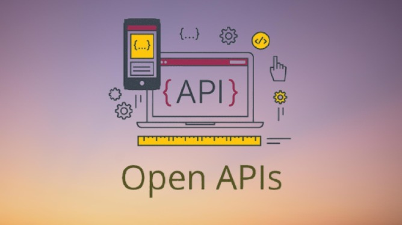

<a id="top"></a>

[](https://github.com/harys722/open-api/network/members)
[](https://github.com/harys722/open-api/stargazers)
[](https://github.com/harys722/open-api/pulls)
[](https://github.com/harys722/open-api/issues)
[](https://github.com/harys722/open-api/blob/main/LICENSE)
[](https://open-api.js.org/)

<div align="center">
  <a href="#">
    
  </a>

  <h1 align="center">Open API</h1>

  <p align="center">
    A free Open API service that provides a variety of endpoints you can make use of in your applications.
    <br />
    <br />
    ⭐ <a href="https://github.com/harys722/open-api">Star Repository</a>
    &bull;
    🐛 <a href="https://github.com/harys722/open-api/issues">Report Bug</a>
    &bull;
    💡 <a href="https://github.com/harys722/open-api/discussions">Submit Suggestions</a>
  </p>
</div>

<p align="center">
  <a href="#"></a>
</p>

# 🔖 Introduction
Our API provides a variety of endpoints that you can use in your applications. To get started with us, select an endpoint from our documentation and follow the instructions specific to that endpoint.

## 🔑 Getting Your Key
To obtain your own personal API key, please read through this [guide](src/getting-started/api-key.md). You may also use the public API key.

## 📖 Documentation
Each endpoint is comprehensively documented, covering all potential URLs, headers, parameters, request bodies, and providing detailed examples of both requests and responses. Access the complete documentation anytime on our [**website**](https://open-api.js.org/).

## ❔ Support
If you have any questions or need assistance, feel free to open an issue for help.

## 💻 Base URL
The base URL for all of our endpoints is:

```
https://api.harys.is-a.dev/v1
```

<p align="center"><a href="#top">⬆️ Back to top!</a></p>
